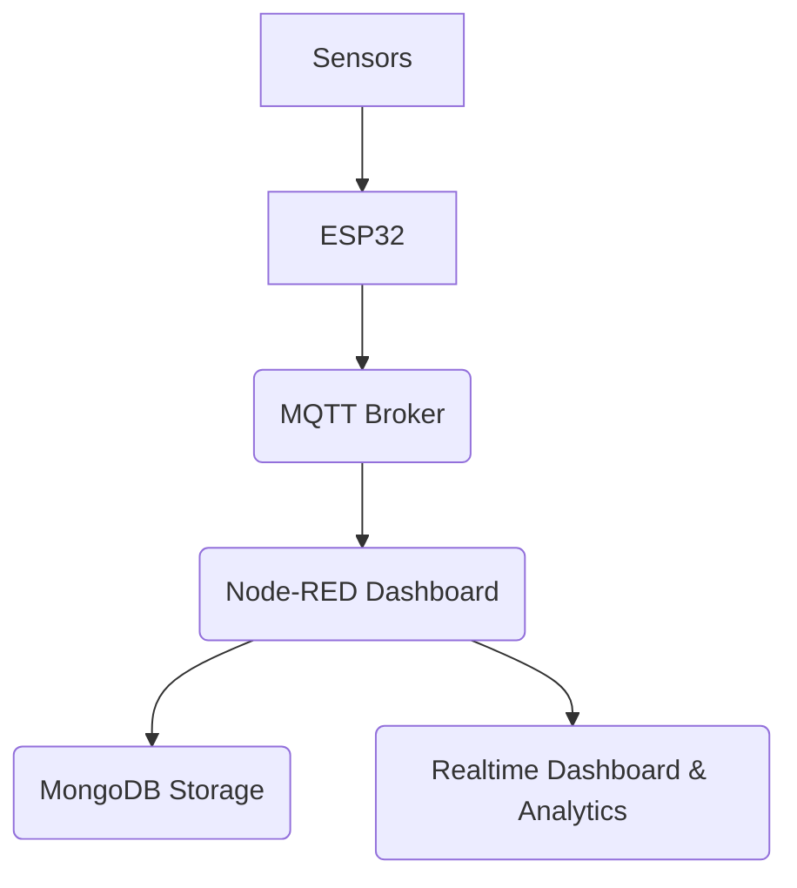

# 💙 Smart Water Quality Monitoring System (SWQMS)

A fully integrated IoT system for **real-time water quality monitoring**, **visualization**, **storage**, and **analytics**. Built using **ESP32**, **HiveMQ MQTT broker**, **Node-RED Dashboard**, and **MongoDB** backend storage.

---

# 🔍 Project Overview

This Smart Water Quality Monitoring System measures:

| Parameter | Sensor |
|:---|:---|
| pH Value | pH Probe |
| Water Temperature | pH Probe (NTC thermistor) |
| Total Dissolved Solids (TDS) | TDS Sensor |
| Turbidity (Water clarity) | Turbidity Sensor |

Collected data is published every **5 seconds** to an **MQTT broker** (HiveMQ) and displayed live on a **Node-RED dashboard** while simultaneously being **stored in a MongoDB database** for historical analysis.

---

# 🏛️ System Architecture

---

# 🔧 Hardware Setup

### Components Used
- ESP32 Dev Board
- pH Probe
- TDS Sensor
- Turbidity Sensor

### Steps to Setup Hardware:

1. Wire the sensors according to the provided circuit diagram.
2. Install **PlatformIO** extension in VSCode.
3. Install **Espressif32** platform via PlatformIO.
4. Place the project folder into: `Documents/PlatformIO/Projects/`
5. Open project, let dependencies auto-install (Internet connection required).

When `.pio` folder appears, setup is complete!

---

# 🧪 Firmware Workflow (ESP32 Code)

### Main Code Structure
- **sensors.h** : Reads and processes sensor data.
- **wifi_manager.h** : Manages Wi-Fi connectivity.
- **mqtt_client.h** : Connects to HiveMQ broker and publishes data.
- **config.h** : Configurations (pins, Wi-Fi credentials, MQTT topics).

### Data Acquisition Process

- Every **1 second**, a sample is taken from each sensor.
- **5 samples** are collected and stored.
- After 5 samples, the average is calculated for each parameter:
  - pH
  - TDS (ppm)
  - Turbidity (NTU)
  - Temperature (°C)
- The **averaged data** is sent to MQTT every **5 seconds**.

### Accuracy Enhancements
- **pH Moving Average Filter**: Smooths out noisy pH readings.
- **Averaging Samples**: Instead of sending one sample, sends average of 5 samples.

### Calibration and Conversion
- pH, TDS, and Turbidity voltages are converted using calibration constants.
- Temperature compensation is available but currently ignored (due to high fluctuations).

---

# 🏠 Node-RED Dashboard Setup

Node-RED acts as the frontend and processing hub.

### Flow Overview:
- **MQTT Input Node**: Receives sensor data.
- **Function Nodes**: Format the data for charts and status displays.
- **Gauge Widgets**: Show live pH, TDS, Turbidity, and Temperature.
- **Status Texts**: Indicate whether each parameter is within safe ranges.
- **Charts**: Plot historical trends of all parameters.
- **Water Quality Index (WQI) Calculation**: Real-time quality score generation.
- **MongoDB Insert Node**: Stores every incoming reading into the database.

### Topics Used
- `reservoir/water_quality/data`: Data publishing topic
- `reservoir/water_quality/commands`: (Reserved) Commands topic

### HiveMQ Secure TLS Connection
- Using `WiFiClientSecure` for secure MQTT communication.
- Connection parameters stored in `config.h`.

---

# 📈 Data Analytics and Big Data Handling

### Data Collection Sessions
- **Morning**: 06:00 – 07:59
- **Afternoon**: 12:00 – 13:59
- **Evening**: 18:00 – 19:59

### Dataset Size
- 4320 readings/day
- ~30,240 readings/week

All timestamps are localized to **Asia/Colombo (UTC+5:30)**.

### Analysis Steps

1. **Timestamp Parsing**
2. **Session Tagging**
3. **Field Filtering** (pH, TDS, Turbidity, Temperature)
4. **Descriptive Statistics**: Mean, Std, Min, Max
5. **Anomaly Detection**:
   - pH < 6.5 or pH > 8.5
   - Turbidity > 2 NTU
6. **Correlation Analysis**: Pearson Coefficient
7. **Trend Smoothing**: 10-sample Moving Average

---

# 📂 Output Files

| File | Purpose |
|:---|:---|
| `basic_statistics.csv` | Summary stats of each parameter |
| `high_turbidity_anomalies.csv` | Readings with Turbidity >2 NTU |
| `unsafe_ph_anomalies.csv` | Readings where pH is unsafe |
| `correlation_matrix.csv` | Correlation between all parameters |
| `correlation_heatmap.png` | Visual correlation plot |
| `session_trends.csv` | Session-wise parameter behavior |
| `.png plots` | Trend graphs (raw + smoothed) |
| `final_report.txt` | Full analytical summary |

---

# 🔎 Deep Dive: Code-Level Breakdown

| Component | Description |
|:---|:---|
| `WaterSensors` class | Reads analog sensors, processes values, moving average filtering (pH) |
| `WiFiManager` class | Handles WiFi connection, periodic reconnection |
| `MQTTClient` class | Handles TLS-secured MQTT communication to HiveMQ, publishes JSON-formatted sensor data |
| `config.h` | Central config for pin mapping, calibration factors, WiFi/MQTT credentials |

---

# 🏅 Key Innovations

- **Moving average smoothing** improves pH measurement stability.
- **Multiple sampling** before MQTT publishing increases reliability.
- **TLS-Secured MQTT** ensures data security over HiveMQ cloud.
- **Full Stack Integration**: ESP32 -> HiveMQ -> Node-RED -> MongoDB -> Dashboard
- **Big Data Handling**: 30,000+ sensor readings managed per week.
- **Water Quality Index (WQI)** calculation and live classification.

---

# 🚀 Future Improvements

- Add support for **temperature compensation** in TDS calculations.
- Implement **alerts/notifications** via email/SMS when anomalies are detected.
- Extend session classification to support full day tracking.
- Train a simple **machine learning model** to predict water quality trends.

---

# 📚 References

- pH, TDS, and Turbidity conversion formulas adapted from sensor datasheets.
- Water Quality Index (WQI) method based on environmental engineering standards.
- MQTT secure connections through HiveMQ broker [HiveMQ documentation](https://www.hivemq.com/).

---

# 🖋️ Author

Developed by **Jeewantha Sadaruwan**

**Contact**: [LinkedIn Profile](#) (update with real link)

**License**: MIT License

---

> \"Small Sensors, Big Insights.\"
